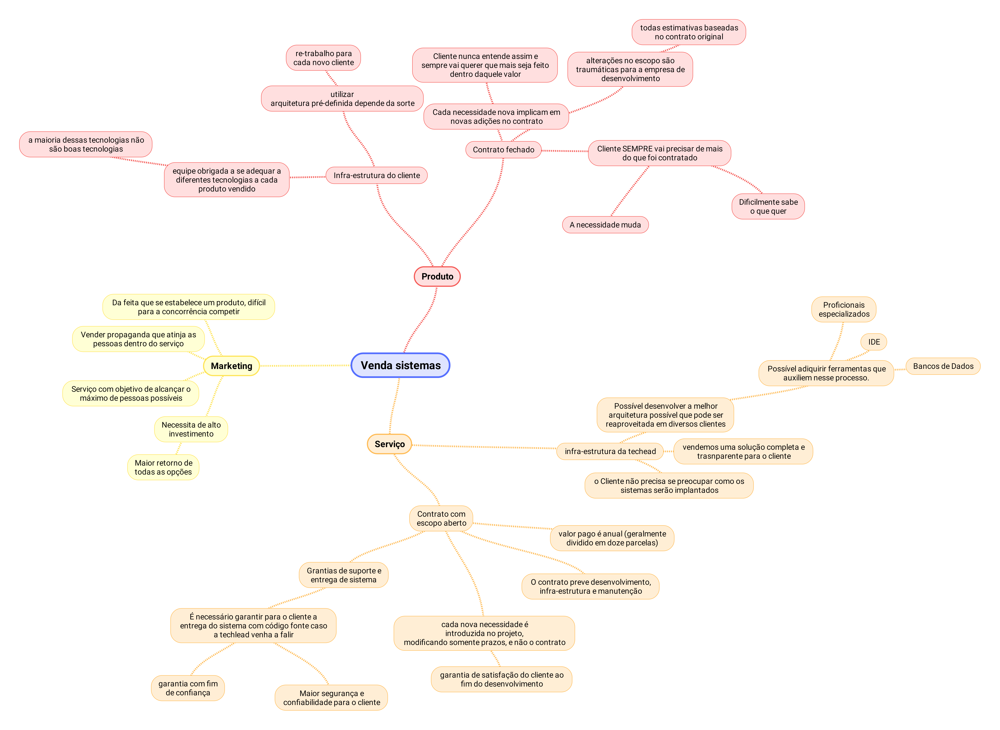
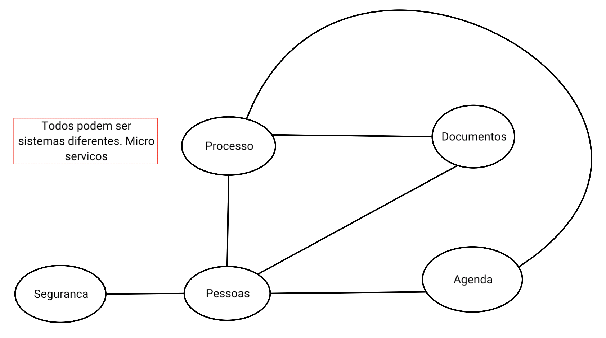

#HSLIDE
# [Modelos de vendas de sistemas](https://github.com/lourencomcviana/presentation/blob/venda/Venda_sistemas.pdf)

#HSLIDE

## Principais
1. Produto
   - Venda da aplicação com único fixado em contrato
   - Propriedade intelectual do cliente
2. Serviço
   - "Aluguel" dos recursos da empresa para criação e sustentação do aplicação
   - Propriedade intelectual da empresa
3. Marketing
   - Atrair um número máximo de público para alguma ferramenta e vender serviço de marketing para outras companhias

#VSLIDE

#HSLIDE
### Situação da TechLead
- Venda mista de produto e serviço
- É produto pois:
  - não temos a propriedade intelectual
  - não existe projeto de sustentação da aplicação
- É quase um serviço pois vendemos horas de trabalho

#VSLIDE
- Vantagens do produto
  - Dinheiro que entra logo é um excelente reforço pra empresa
- Desvantagens do produto
  - Sem propriedade intelectual
  - Sistema engessado para a infra do cliente (no nosso caso, uma bem ruim)
  - Arquitetura com baixo reaproveitamento
  (cada cliente uma infra diferente)
  - Crescimento da empresa lento e custoso

#VSLIDE
- Vantagens do serviço
  - Arquitetura da techlead pode ser implementada e reaproveitada
  - Uso das melhores tecnologias disponíveis
  - Vender para quantos clientes podermos
  - Lucro anual quase que garantido
  - Estipulação de custos mais simples
    - valor mensalidade ou anuidade/custos de operação = lucro
  - Cliente não se preocupa com infra
    - Solução bem mais completa

#VSLIDE
- Desvantagens do serviço
  - Cliente se sente inseguro em "não ter o produto na mão"
    - E se a techlead falir?
    - E se o suporte for horríve?
    - E se colocarem meu sistema em um computador da xuxa movido a lenha?
  - necessidade de dar garantias para o cliente 
    - caso a empresa falir, garantir a entrega do código fonte e de uma implantação em cloud funcionando (da amazon, por exemplo).
    - Neste caso extremo, o sistema deve entrar no modelo de código aberto para que todos os clientes possam usar (e melhorar caso desejem)

#VSLIDE
- Vantagens do marketing
  - Maior custo/benefício dentre todas as soluções
  - Todas as vantagens do serviço sem as desvantagens
- Desvantagens do marketing
  - Alto investimento
  - Necessita de tempo para "emplacar"
  - Um produto de sucesso atrai forte concorrência, um deslize e você está fora do jogo

#HSLIDE
## Sisjuri

